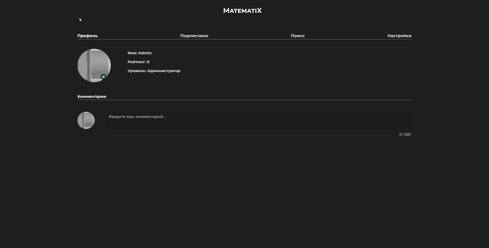
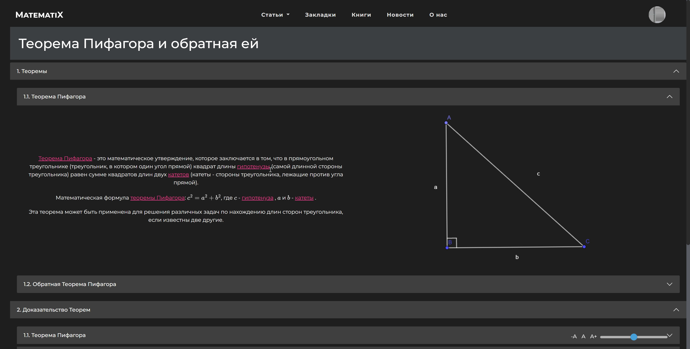
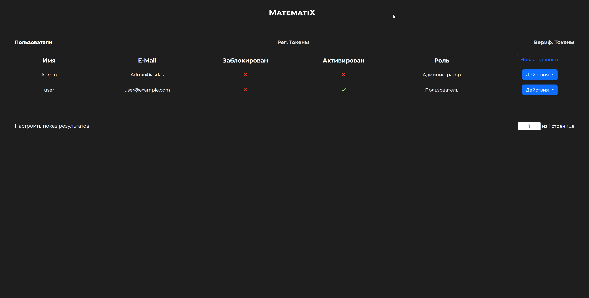

# MatematiX

**MatematiX** — это учебное веб-приложение на Java и Spring Boot, демонстрирующее навыки разработки, контейнеризации и облачного развёртывания. Пользователи могут регистрироваться, авторизовываться и управлять записями (CRUD) в личном кабинете.

Сайт доступен:
- Через Docker (локально) (Рекомендуется)
- На бесплатном слое Render.com: `https://matematix-app.onrender.com` (может быть медленным из‑за бесплатного тарифа, возможны ошикби, связанные с JS из-за "усыпления" сайта)

---

## 📦 Текущие возможности

- Регистрация и авторизация пользователей (Spring Security), защита через CSRF token;
- CRUD-интерфейс для управления пользователями и токенами, с поиском и сортировкой по различным параметрам, поддержка пагинации;
- Работа с MySQL через Spring Data JPA;
- Логирование и обработка ошибок;
- Dockerized-сборка и контейнеры для приложения и БД;
- Комментарии, сделанные на основе AJAX запросов, с поддержкой технологии WebSocket;
- Добавление аватарки с использованием cropper.js;
- Уведомления с использованием Toastr.js;
- Добавление подписчиков;
- Статьи, с использованием MathJAX;
- Работа с почтовыми сервисами через протокол SMTP
- Управление зависимостями и сборка проекта (Maven)
---


## 🚀 Запуск проекта

### Что важно знать, перед запуском проекта:
- Доступ в админ панель доступен только пользователю с никнеймом "admin". На render.com такой пользователь зарегестрирован и имеет пароль "admin". Если запускать через Docker, потребуется регистрация.
### Вариант A: Локально через Docker (Рекомендуется)

1. Соберите образ приложения:
   
   ```bash
   docker build -t mypetproject:latest .
  
2. Запустите с Docker Compose:
   
   ```bash
   docker-compose up -d
  

3. Откройте в браузере [localhost](http://localhost:8080)

### Вариант B: Облачный запуск на Render.com (не рекомендуется)
1. Просто перейдите по ссылке:

`https://matematix-app.onrender.com`

## 🎯 Будущие цели

- Создать чат между пользователями с криптографией сообщений

- Добавить побольше статей о математике

- Интеграция внешних API (уведомления, аналитика)

- UI на React с адаптивным дизайном

- Кэширование, мониторинг и оптимизация производительности

## ❓ Зачем этот проект


Этот проект служит витриной моих ключевых навыков в разработке на Java и Spring:

- Spring Framework & Spring Boot: настройка приложений, внедрение зависимостей, автоконфигурация.

- Java & экосистема: применение современных возможностей Java, работа с коллекциями, потоками и лямбдами.

- Spring-плагины: интеграция Spring Security, Spring Data JPA, Spring MVC.

- REST API: проектирование удобных и надёжных HTTP-интерфейсов с валидацией и обработкой ошибок.

- Контейнеризация: упаковка приложения в Docker-контейнер для портируемости и масштабируемости.

Цель проекта — продемонстрировать полный цикл разработки: от написания кода до CI/CD и развёртывания в облаке.

## 📁 Структура репозитория
<pre>
├── src/                  # Исходный код приложения (Java)
├── Dockerfile            # Сборка Docker-образа
├── docker-compose.yml    # Локальный запуск контейнеров
├── README.md             # Документация (этот файл)
├── pom.xml               # Maven-конфигурация
└── ...
  
</pre>
## 📄 Лицензия

Этот проект лицензирован под MIT License. Подробности в файле LICENSE.

## Скриншоты

### Главная страница

### Профиль пользователя

### Пример статьи

### CRUD система

